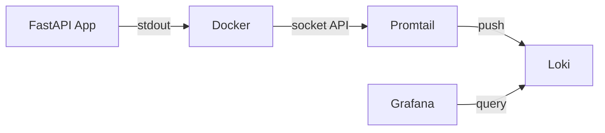
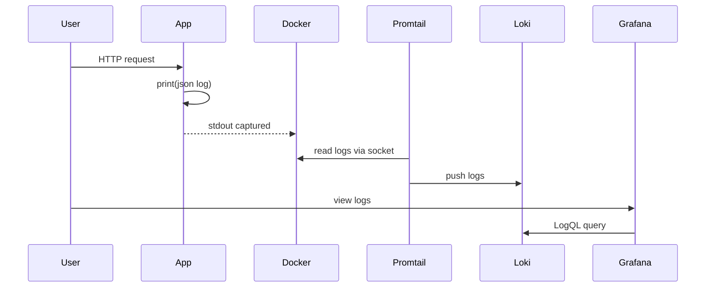

# Docker Logging with PLG Stack

MSA-2 Project: Centralized logging for Docker containers using Promtail, Loki, and Grafana.

## Architecture



## Data Flow



The app writes structured JSON logs to stdout. Docker captures all container stdout/stderr automatically. Promtail discovers running containers via Docker's socket API and reads their logs. It then pushes these logs to Loki, which indexes them by labels (container name, service, etc.) for fast querying. Grafana provides a web UI to query and explore the logs using LogQL.

## Quick Start

```bash
make up      # start all services
make test    # generate test logs
make down    # stop all services
make help    # show all commands
```

## Services

| Service  | Port | Description |
|----------|------|-------------|
| app      | 8000 | FastAPI app with JSON logging |
| loki     | 3100 | Log storage |
| promtail | -    | Log collector |
| grafana  | 3000 | Web UI (admin/admin) |

## View Logs in Grafana

1. Open http://localhost:3000 (login: admin/admin)
2. Go to **Explore** (compass icon)
3. Query: `{container="logging-demo-app"}`

### Example Queries

```logql
{container="logging-demo-app"}              # all app logs
{container="logging-demo-app"} |= "greeting" # filter by text
{container="logging-demo-app"} | json        # parse JSON fields
```

## Project Structure

```
app/
├── main.py           # FastAPI with JSON logging
├── Dockerfile
└── pyproject.toml
promtail/
└── config.yml        # Docker service discovery config
grafana/provisioning/
└── datasources/
    └── loki.yaml     # Auto-configured Loki datasource
docker-compose.yml
Makefile
```

## Troubleshooting

```bash
make ps              # check containers running
make logs-promtail   # check promtail logs
make logs-app        # check app logs
curl localhost:3100/ready  # check loki health
```

## Note: Rancher Desktop

This project uses Docker's socket API (`docker_sd_configs`) instead of scraping log files from `/var/lib/docker/containers`. This is necessary because Rancher Desktop (and Docker Desktop) run containers inside a VM, making the log files inaccessible from the host. The socket API approach works universally regardless of how Docker is installed.
