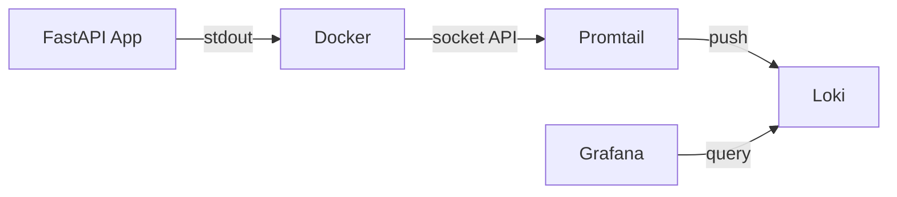
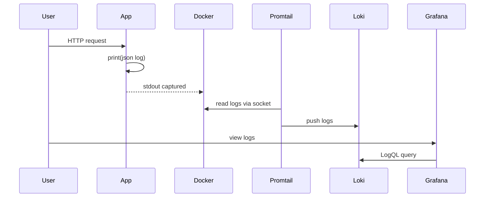

# Docker Logging with PLG Stack

**Completed by:** Safwan Zullash (se24m037) and Ines Petrusic (se24m013)

MSA-2 Project: Centralized logging for Docker containers using Promtail, Loki, and Grafana.

## Architecture



## Data Flow



The app writes structured JSON logs to stdout. Docker captures all container stdout/stderr automatically. Promtail discovers running containers via Docker's socket API and reads their logs. It then pushes these logs to Loki, which indexes them by labels (container name, service, etc.) for fast querying. Grafana provides a web UI to query and explore the logs using LogQL.

## Quick Start

```bash
make up      # start all services
make test    # generate test logs
make down    # stop all services
make help    # show all commands
```

## Services

| Service  | Port | Description |
|----------|------|-------------|
| app      | 8000 | FastAPI app with JSON logging |
| loki     | 3100 | Log storage |
| promtail | -    | Log collector |
| grafana  | 3000 | Web UI (admin/admin) |

## View Logs in Grafana

1. Open http://localhost:3000 (login: admin/admin)
2. Go to **Explore** (compass icon)
3. Query: `{container="logging-demo-app"}`

### Example Queries

```logql
{container="logging-demo-app"}              # all app logs
{container="logging-demo-app"} |= "greeting" # filter by text
{container="logging-demo-app"} | json        # parse JSON fields
```

## Project Structure

```
app/
├── main.py           # FastAPI with JSON logging
├── Dockerfile
└── pyproject.toml
promtail/
└── config.yml        # Docker service discovery config
grafana/provisioning/
└── datasources/
    └── loki.yaml     # Auto-configured Loki datasource
docker-compose.yml
Makefile
```

## Troubleshooting

```bash
make ps              # check containers running
make logs-promtail   # check promtail logs
make logs-app        # check app logs
curl localhost:3100/ready  # check loki health
```

## References

### Docker Logging
- **Docker Logging Drivers**: How Docker captures container stdout/stderr with `json-file` driver  
  https://docs.docker.com/engine/logging/configure/
- **Docker Daemon Socket**: `/var/run/docker.sock` is the default Unix socket for Docker daemon communication  
  https://docs.docker.com/reference/cli/dockerd/#daemon-socket-option

### Promtail Configuration
- **Docker Service Discovery**: How `docker_sd_configs` discovers containers via Docker API  
  https://grafana.com/docs/loki/latest/send-data/promtail/scraping/#docker-service-discovery
- **Configuration Reference**: Full `docker_sd_configs` options and `__meta_docker_*` labels  
  https://grafana.com/docs/loki/latest/send-data/promtail/configuration/#docker_sd_configs
- **Pipeline Stages**: JSON parsing and label extraction stages  
  https://grafana.com/docs/loki/latest/send-data/promtail/pipelines/

### Why Socket API Instead of File Scraping

This project uses Docker's socket API (`docker_sd_configs`) instead of scraping log files from `/var/lib/docker/containers`. This is necessary because Rancher Desktop (and Docker Desktop) run containers inside a VM, making the log files inaccessible from the host.

- **Rancher Desktop Architecture**: Documents that containers run inside a VM on macOS/Linux  
  https://docs.rancherdesktop.io/references/architecture
- **Docker Desktop VM**: Explains why `/var/lib/docker` is inside VM, not accessible from host  
  https://stackoverflow.com/questions/60408574/how-to-access-var-lib-docker-in-windows-10-docker-desktop

### Course Resources
- **PLG Stack Tutorial**: Example Promtail-Loki-Grafana setup (uses file scraping approach)  
  https://medium.com/django-unleashed/get-visibility-into-your-docker-container-logs-with-grafana-loki-of-a-django-application-9584bddfe540
