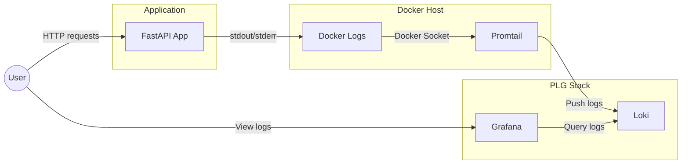
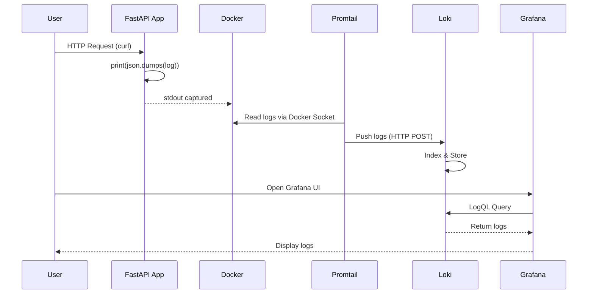
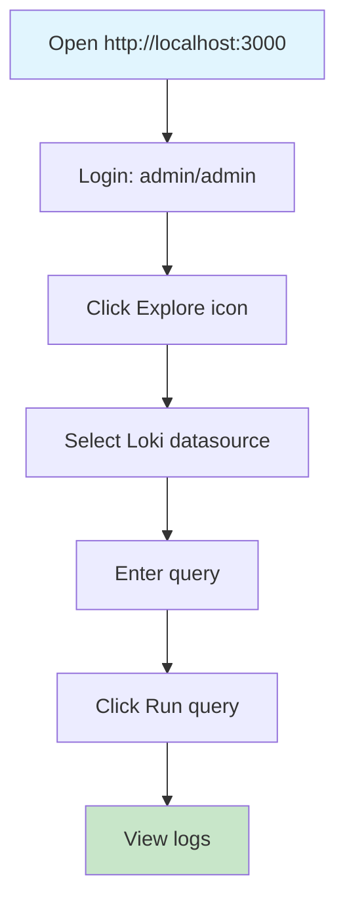
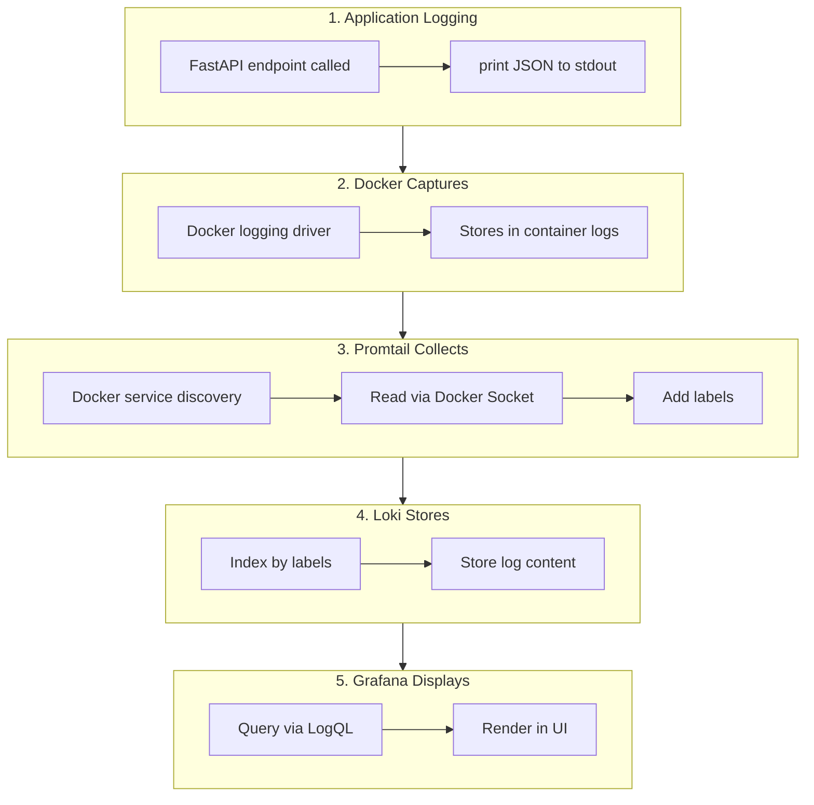
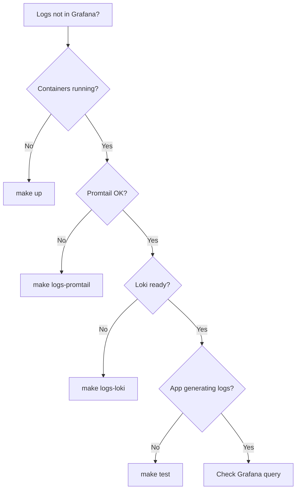

# Docker Logging with PLG Stack (Promtail, Loki, Grafana)

MSA-2 Project: Adding logging capabilities to a local Docker host using the PLG stack.

## Architecture



### Data Flow



## Prerequisites

- Docker (Docker Desktop, Rancher Desktop, or Docker CLI)
- Docker Compose
- Make (optional, for convenience commands)

## Project Structure

```
.
├── app/
│   ├── Dockerfile
│   ├── main.py              # FastAPI application
│   └── pyproject.toml       # Python dependencies (uv)
├── promtail/
│   └── config.yml           # Promtail configuration
├── grafana/
│   └── provisioning/
│       └── datasources/
│           └── loki.yaml    # Loki datasource config
├── docker-compose.yml
├── Makefile                 # Convenience commands
└── README.md
```

## Quick Start

### Using Make (Recommended)

```bash
# Show all available commands
make help

# Start the stack
make up

# Generate test logs
make test

# View logs
make logs

# Stop the stack
make down
```

### Using Docker Compose Directly

```bash
# Start the stack
docker compose up -d

# Stop the stack
docker compose down
```

## Services

| Service   | Port | URL                     | Description                    |
|-----------|------|-------------------------|--------------------------------|
| app       | 8000 | http://localhost:8000   | FastAPI application            |
| loki      | 3100 | http://localhost:3100   | Log aggregation database       |
| promtail  | -    | -                       | Log collector (no exposed port)|
| grafana   | 3000 | http://localhost:3000   | Visualization dashboard        |

## Generate Test Logs

Make API calls to generate log entries:

```bash
# Using make
make test

# Or manually
curl http://localhost:8000/
curl http://localhost:8000/hello/Alice
curl http://localhost:8000/hello/Bob
```

## View Logs in Grafana



### Step-by-Step

1. Open Grafana: http://localhost:3000
2. Login with:
   - Username: `admin`
   - Password: `admin`
3. Go to **Explore** (compass icon in left sidebar)
4. Select **Loki** as the data source (should be pre-selected)
5. Run a query:
   - Click **Label browser** and select `container` = `logging-demo-app`
   - Or enter the query: `{container="logging-demo-app"}`
6. Click **Run query** to see the logs

### Example LogQL Queries

```logql
# All logs from the app
{container="logging-demo-app"}

# Filter by event type
{container="logging-demo-app"} |= "greeting"

# Parse JSON and filter
{container="logging-demo-app"} | json | event="greeting"

# All container logs
{service="app"}
```

## How It Works



1. **Application Logging**: The FastAPI app writes structured JSON logs to stdout using `print()`. Docker automatically captures stdout/stderr from containers.

2. **Log Collection (Promtail)**: Promtail uses Docker service discovery (`docker_sd_configs`) to find running containers and read their logs via the Docker API. It adds labels like container name and service.

3. **Log Storage (Loki)**: Promtail sends logs to Loki, which indexes them by labels and stores the log content efficiently.

4. **Visualization (Grafana)**: Grafana queries Loki and displays logs in a user-friendly interface with filtering and search capabilities.

## Makefile Commands

Run `make help` to see all available commands:

```
Usage: make [target]

Targets:
  help        Show this help message
  up          Start all services
  down        Stop all services
  down-v      Stop all services and remove volumes
  restart     Restart all services
  logs        Show logs from all services
  logs-app    Show logs from the app service
  logs-loki   Show logs from loki
  logs-promtail Show logs from promtail
  ps          Show running containers
  test        Generate test log entries
  build       Build the app image
  clean       Remove all containers, volumes, and images
```

## Troubleshooting

### Logs not appearing in Grafana



1. Check if all containers are running:
   ```bash
   make ps
   ```

2. Check Promtail logs:
   ```bash
   make logs-promtail
   ```

3. Check if Loki is receiving logs:
   ```bash
   curl http://localhost:3100/ready
   ```

4. Verify the app is generating logs:
   ```bash
   make logs-app
   ```

### Connection refused errors

Make sure all services are on the same Docker network (`loki`).

## Cleanup

```bash
# Stop services
make down

# Stop services and remove volumes
make down-v

# Full cleanup (containers, volumes, images)
make clean
```
